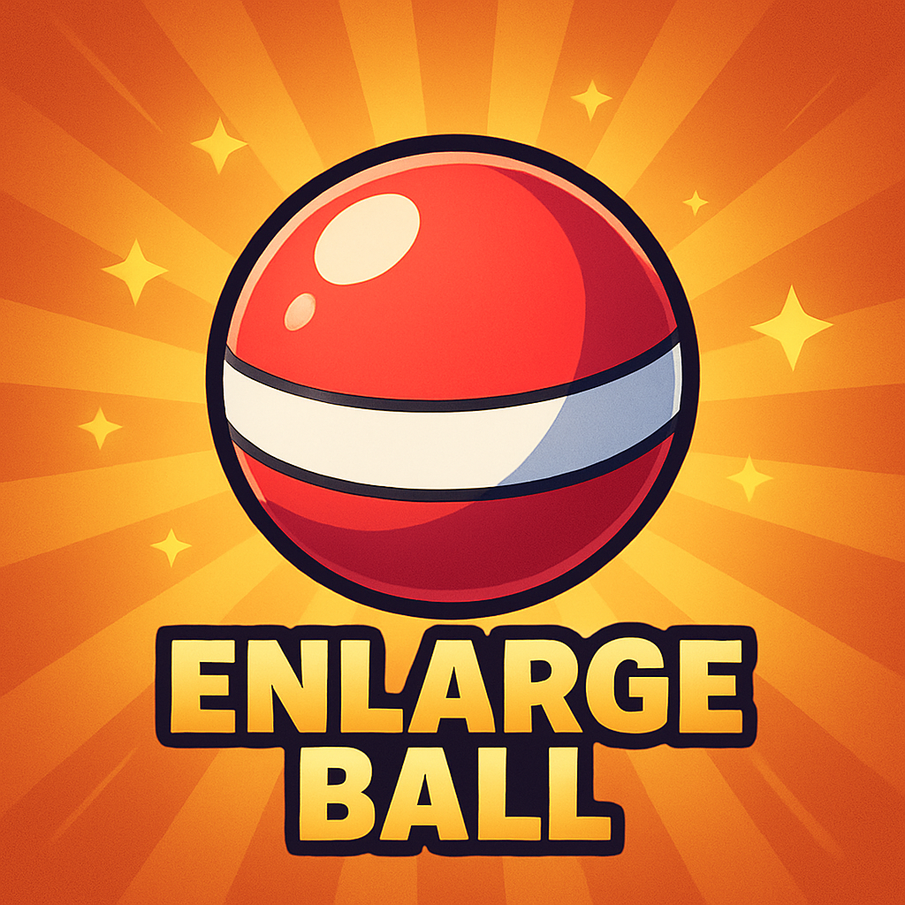
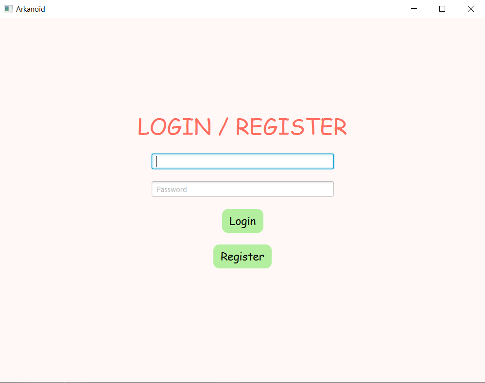
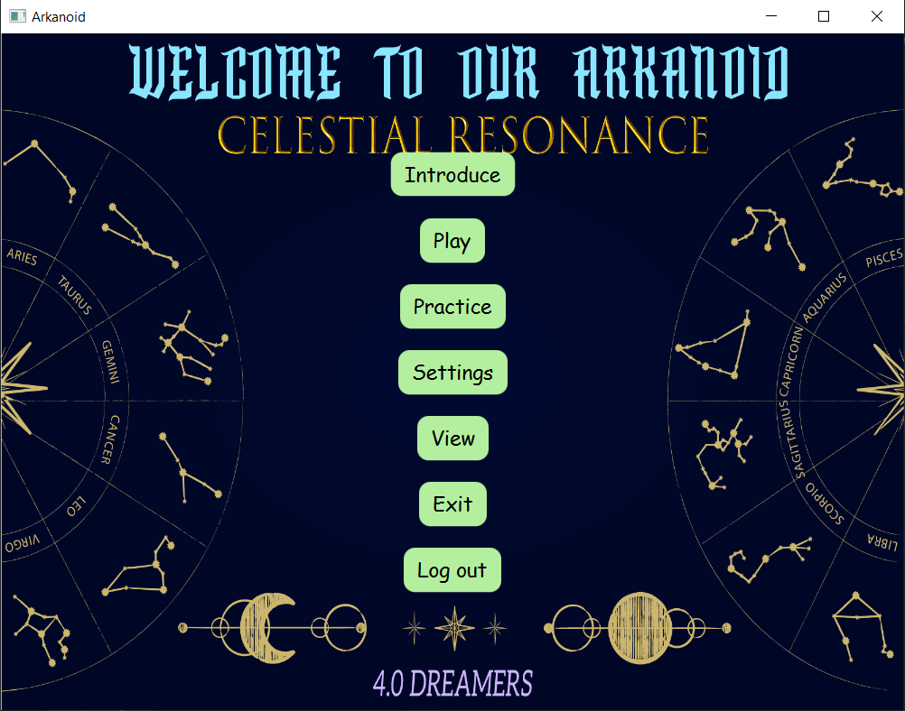
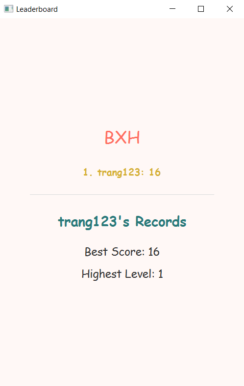

Arkanoid Game - Celestial Resonance - Object-Oriented Programming Project
---

Author
---

Group 2 - Class INT2204 11

1. Nguyễn Thùy Trang - 24021644
2. Nguyễn Minh Anh - 24021370
3. Phan Yến Nhi - 24022705
4. Trịnh Thị Vân - 24022842

Instructor: Kiều Văn Tuyên
Semester: HK1 - 2025
---

Description
---
This is a classic Arkanoid game developed in Java as a final project for Object-Oriented Programming course. The project demonstrates the implementation of OOP principles and design patterns.

Key feature:
1. The game is developed using Java 21+ with JavaFX for GUI.

2. Implements core OOP principles: Encapsulation, Inheritance, Polymorphism, and Abstraction.

3. Applies multiple design patterns: 
- Factory: BrickFactory 
- Behavior Pattern: GameLoop
- Facade: World, MainMenu, LevelSelect
- Strategy: Storage, ScoringSystem, ThemeManager
- State: MainMenu, LevelSelect, Setting, InGame, End
- Observer: EventBus, MainMenu, LevelSelect, Setting, End, Shop
- Command: InGame
- Singleton: AudioSystem, ScoringSystem, JSonStorage, SQLiteStorage, ThemeManager
- Object Pool: PowerUpPool
- Reposity Pattern: PlayerRepository, ScoreRepository
- Builder: ButtonUI
- MVC: Game, World, ui/screen/*
- Logger: Logger, ErrorHandle

4. Features multithreading for smooth gameplay and responsive UI.
- Luồng Game Loop 60 fps -> GameLoop
- Luồng Render -> Game, GameLoop
- Thread âm thanh -> AudioSystem
- I/O -> Storage, Game, MockServer

5. Includes sound effects, animations, and power-up systems.

6. Supports save/load game functionality and leaderboard system.

Game mechanics:
- Control a paddle to bounce a ball and destroy bricks

- Collect power-ups for special abilities 

- Having practice mode to practice

- Score points and compete on the leaderboard
***

UML Diagram

Complete UML diagrams are available in the docs/uml/src.uml
---

**Design Patterns Implementation**
1. Factory

Used in : BrickFactory

Purpose : Sinh gạch đúng loại theo mã

2. Object Pool

Used in : PowerUpPool

Purpose : Tối ưu tái sử dụng PowerUp

3. Singleton

Used in : AudioSystem, ScoringSystem, JSonStorage, SQLiteStorage, ThemeManager

Purpose : Quản lý tài nguyên chung

4. Builder

Used in : ButtonUI

Purpose : Tạo nút có style/tham số linh hoạt

5. Facade 

Used in : World, MainMenu, LevelSelect

Purpose : Che giấu phức tạp scene và entity

6. MVC

Used in : Game, World, ui/screen/*

Purpose : Phân tách Model–View–Controller

7. Strategy

Used in : Storage, ScoringSystem, ThemeManager

Purpose : Dễ đổi backend hoặc cách tính điểm

8. Behavior Pattern

Used in : GameLoop

Purpose : Chu trình update–render

9. Observer

Used in : EventBus, MainMenu, LevelSelect, Setting, End, InGame

Purpose : Truyền sự kiện HUD, âm thanh

10. State

Used in : MainMenu -> InGame -> End

Purpose : Quản lý trạng thái game

11. Reposity Pattern

Used in : PlayerRepository, ScoreRepository

Purpose : CRUD dữ liệu người chơi

12. Logger

Used in : Logger, ErrorHandle

Purpose : Ghi log và xử lý ngoại lệ
---

**Multithreading Implementation**
The game uses multiple threads to ensure smooth performance:

1. Game Loop Thread: Updates game logic at 60 FPS

2. Rendering Thread: Handles graphics rendering (EDT for JavaFX Application Thread)

3. Audio Thread Pool: Plays sound effects asynchronously

4. I/O Thread: Handles save/load operations without blocking UI
---

**Installation**
1. Clone the project from the repository.
2. Open the project in the IDE.
3. Run the project.

**Usage**

**Control**
🎰. HOW TO PLAY – CELESTIAL RESONANCE

🌟 MAIN MENU

PLAY – Start the main journey or continue your current level.

PRACTICE – Train freely by choosing any level you like.

SETTING – Choose background music, toggle sound, or change paddle style.

VIEW – Check your scores and achievements.

LOG OUT - back and login new acc

EXIT – Quit the game.

🕹️ IN-GAME CONTROLS

SPACE – Launch the ball to start.

ESC – Pause the game.

C – Continue playing.

R 
      + In PLAY: Restart from the first level or when LOSE.
      + In PRACTICE: Restart the current level.

ENTER – In PRACTICE, return to the level selection screen.

M – Go back to the main menu (progress is saved in PLAY mode).

✨Break the seals – Restore the light of the 12 constellations!
---

**How to Play**

1. **Start the game:** Click "Play" from the main menu.

2. **Control the paddle:** Use <- / -> to move left and right.

3. **Launch the ball:** Press SPACE to launch the ball from the paddle.

4. **Destroy bricks:** Bounce the ball to hit and destroy bricks.

5. **Collect power-ups:** Catch falling power-ups for special abilities.

6. **Avoid losing the ball:** Keep the ball from falling below the paddle.

7. **Practice:** Click "Practice" from the main menu

8. **Select sounds, colors of paddle, turn music:** Click "Settings"

8. **Complete the level:** Destroy all destructible bricks to advance.

**Power-ups**
1. BonusCoin                

2. DoubleBall               

3. EnLargeBall                        

4. EnLargePaddle            

5. ExtraLife                

6. ShootPaddle              

7. ShrinkPaddle             

8. SlowBall                 

9. SpeedBall                

**Scoring System**

- 1 brick = 1 score

- BounusCoin + 10 scores
---

**Demo**
1. Login :

2. MainMenu:

3. LeaderBoard:

4. Demo:

<video controls src="2025-11-12 23-58-17.mkv" title="Title"></video>
***

**Future Improvements**
---
**Planned Features**
1. Additional game modes

- Add Shop to buy themes with scores

- Survival mode with endless levels

- Co-op multiplayer mode

2. Enhanced gameplay

- Boss battles at end of worlds

- More power-up varieties (freeze time, shield wall, etc.)

- Achievements system

3. Technical improvements

- Migrate to LibGDX or JavaFX for better graphics

- Add particle effects and advanced animations

- Implement AI opponent mode

- Add online leaderboard with database backend
---

**Technologies Used**

Phụ thuộc vào local mỗi thành viên!
---

**License**
This project is developed for educational purposes only.

Academic Integrity: This code is provided as a reference. Please follow your institution's academic integrity policies.

 
---

**Notes**
- The game was developed as part of the Object-Oriented Programming with Java course curriculum.

- All code is written by group members with guidance from the instructor.

- Some assets (images, sounds) may be used for educational purposes under fair use.

- The project demonstrates practical application of OOP concepts and design patterns.
---

*Last update: 12/11/2025*

