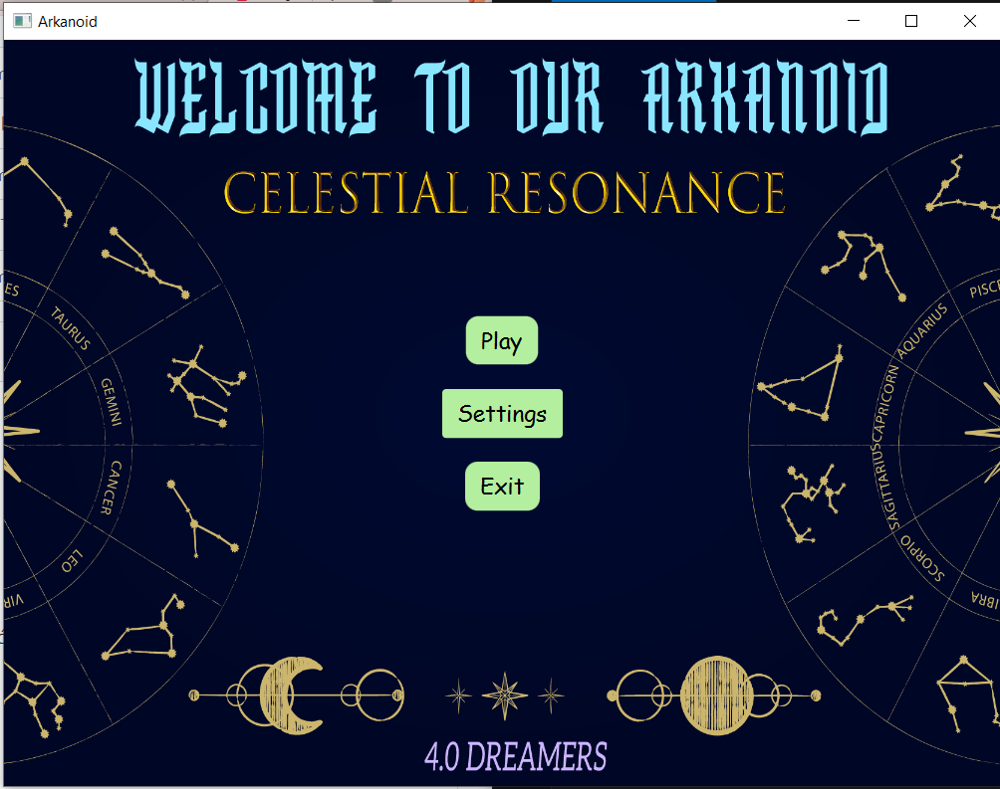
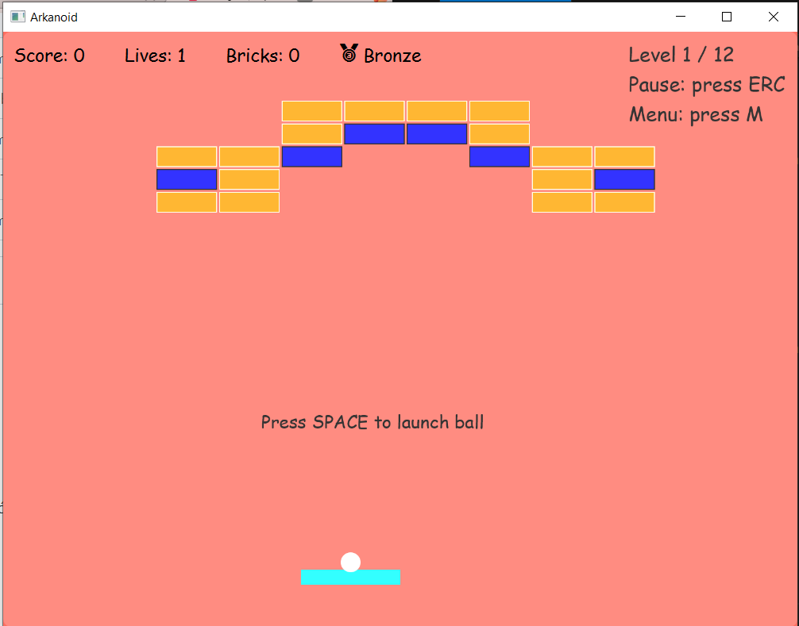
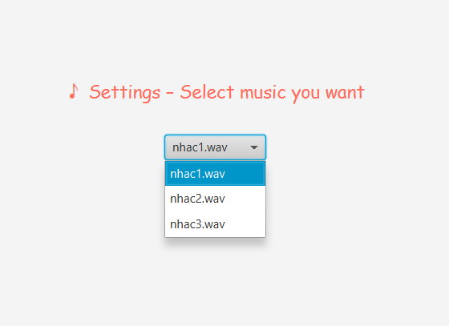

"BTL OOP 11"

Nhóm 4.0-Dreamers

ERC = pause

M = back to menu

C = resume

R = Restart

SPACE = bắn bóng

A - TUẦN 1:

- Chạy được level 1: Chỉnh sửa va chạm với biên, đá, vợt mượt

- Chuyển màn từ start sang level

- Hiện HUD

- Vẽ bằng canvas

B - Tuần 2 :

- Thêm settings chọn 3 loại nhạc, thêm âm thanh hitbrick

- Tạo 12 level 

- Thêm 4 loại gạch

- Ghi nhận thành tích

- Thêm powerups

- Chỉnh collision cho va chạm mượt

